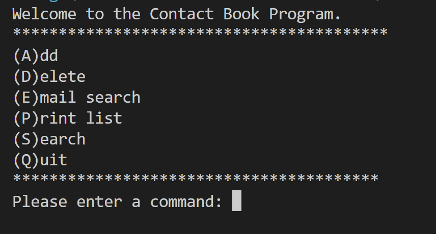

# Data Structure Week 4 - Contact Book

**Name:** Ella Raputri

**Class:** L2AC

**Student ID:** 2702298154

 

This is a simple contact book program that implements Linked List. It runs in the terminal and can perform some basic operations related to the management of contacts. The operations involve addition or insertion, deletion, search based on email, print list of contacts, and search based on name.

## Evidence of Running Program
</img>

## List of Java Files (in 'code' folder)
- Contact.java, contains the class Contact, which has the name, email, and phone number attributes. This class also contains some methods that are related to a contact.
- ContactBook.java, contains the class ContactBook which has the attribute contact_list that is a Linked List and a scanner for user input. In this class, there are also implementation methods for contact book operations.
- Main.java, is the driver file to run all the methods that have been implemented. 
